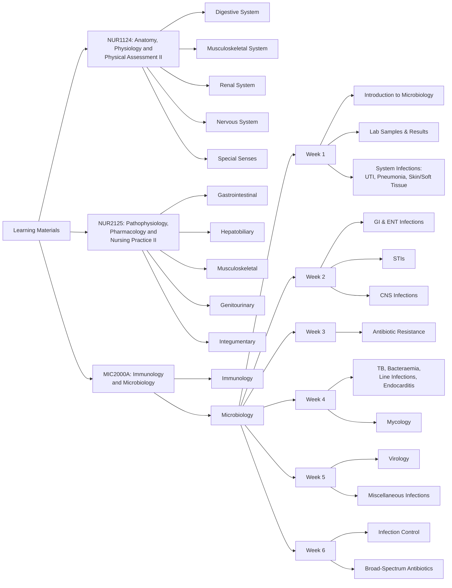

# Project Quiz Me

## Description

This Python-based project allows the users to create exams questions based on the module contents.

## Features

- Streamlit app that allows users to specify the desired module and topic and generate quiz questions with source and answers.

## Requirements

- Python 3.x

## Installation

1. Clone this repository
2. Install required dependencies:

For developers,
1. Install `pre-commit` before pushing changes

```bash
uv add pre-commit
uv run pre-commit install
```

## Process

The process follows the guidelines outlined by the team at Microsoft Azure.

### 1. Preparation Phase

#### Determine the solution domain

##### Overview

###### Pain Points

Nursing students, especially mid-career transitioners, often feel overwhelmed while studying for exams under time pressure. Some of the common challenges include:

1. Struggling with retaining what they have already learnt.
2. Not knowing how to identify what is important to study for exams.
3. A lack of practice questions with verified answers to tackle exams more confidently.

###### Possible Root Cause

One of the factors leading to feeling overwhelmed could stem from ineffective studying techniques. While students are putting in the time and effort to study, they may be using techniques such as highlighting or reading notes, which may not aid in memory retention.

###### Solution

To tackle the above root cause, one possible aid could be to generate flashcard question and answer pairs with explanations, to aid in active recall, which helps with memorization (Source: [Memorization Strategies](https://learningcenter.unc.edu/tips-and-tools/enhancing-your-memory/#:~:text=Use%20distributed%20practice.&text=Use%20repetition%20to%20firmly%20lodge,in%20between%20each%20study%20session.)). A proposed solution would be to build an end-to-end Machine Learning pipeline to index learning materials from the modules and retrieve relevant context based on the user's query, and then utilize an existing Large Language Model (LLM) to generate and evaluate such exam questions.

An appropriate pattern to use would be the Retrieval-Augmented Generation (RAG) pattern, an "industry-standard approach to building applications that use language models to process specific or proprietary data that the model doesn't already know" (Source: [Azure article](https://learn.microsoft.com/en-us/azure/architecture/ai-ml/guide/rag/rag-solution-design-and-evaluation-guide)). The RAG framework is used so as to ensure relevancy to the exams' context, and that the exam questions are based on valid knowledge.

This project aims to build a proof of concept for the above use case, specifically for a subset of modules. After being proven for this use case, we can then add additional modules as the term goes along. Extending from that, the model could be a:

1. personal tutor for the students' strengths and weaknesses, testing them more on certain topics that they're weaker in.
2. emotional support while studying, offering kind words and encouragement.
3. implementation of active recall and retention techniques, adjusting the time between the last time they were tested on the topic, and the next time they should be tested, based on their familiarity with the topic.

Overall, the solution aims to help students be more confident and prepared in their journey of learning and studying.

The kind of questions the solution should answer include:

1. "Give me flashcard questions and answers on [module name] on the topic of \[topic\]"
2. "Give me MCQ exam questions and answers on [module name] on the topic of \[topic\]"

- The following are the modules with exams:

| Module                                                                     | Mid-term exam | Remarks                                | Final exam   | Remarks                                |
| :------------------------------------------------------------------------- | :------------ | :------------------------------------- | :----------- | :------------------------------------- |
| NUR1124: Anatomy, Physiology and Physical Assessment II                    | Y (MCQ, 40%)       |                                        | Y (MCQ, 60%)      |                                        |
| NUR2125: Pathophysiology, Pharmacology and Nursing Practice II             | Y (MCQ, 30%)  | 10 questions each for the 3 components | Y (MCQ, 60%) | 20 questions each for the 3 components |
| MIC2000A: Infection and Immunology                                         | Y (MCQ)       |                                        | Y (MCQ)      |                                        |
| NUR2124: Health Promotion in the Community                                 | N             |                                        | N            |                                        |
| MD1902: Professional Practice 1: The Foundations of Health Professionalism | N             |                                        | Y (Essay)    |                                        |
| PL1101E: Introduction to Psychology                                        | N             |                                        | N            |                                        |

**NUR1124**
1. Digestive System
- Overview of structure and function of the digestive system
- Histological organization of the digestive tract
- GIT motility and control of digestive function
- Structure of the peritoneum
- Structure and function of individual areas of the GIT
- Oral cavity including salivary glands, pharynx, oesophagus, stomach,
- small intestine and associated glands and organs, large intestine
- Digestion and absorption
- Physical assessment of normal digestive system
2. Musculoskeletal System
- Classification of bones
- Bone development and growth
- Bone homeostasis and fracture repair
- Identification of bones in the axial and appendicular skeletons
- Structure and function of joints
- Muscle Tissue
- Anatomy of skeletal muscle
- Identification of the major skeletal muscles in the human body
- Contraction of skeletal muscle
- Control of skeletal muscle activity
3. Renal System
- Overview of structure and function of the urinary system
- Microscopic and macroscopic structure of the urinary system organs
- including the nephron
- Physiology of urine production and micturition process
- Role of the kidney in fluid and electrolyte balance
4. Nervous System
- Overview of the nervous system
- Microscopic and macroscopic anatomy of nervous tissue
- Physiological basis for generation and transmission of the nerve
- action potential
- Regions and structures of the brain and corresponding function
- Protective mechanisms for the brain
- Consciousness, sleep & memory
- Structural and functional aspects of the spinal cord
- Classification of sensory receptors and receptor physiology
- Structural and functional aspects of reflex activity
- Cranial nerves and their associated function
- Structure and function of the autonomic nervous system
- Physical assessment of normal nervous system
5. Special Senses
- Structure and function of the eye including physiology of vision
- Structure and function of the ear including physiology of hearing

**NUR2125**

**Learning Objectives**:
Upon completion of the module, students will be able to:

1. discuss the pathophysiology and principles of management related to common gastrointestinal (GI), hepatobiliary, renal, urinary, musculoskeletal, and integumentary conditions;
2. apply principles of health assessment and clinical reasoning procedures to systematically gather history and perform a focused physical examination;
3. analyse diagnostic investigation results and assessment findings to formulate differential diagnoses;
4. explain the pharmacology of medications used;
5. discuss the nursing management; and
6. perform related clinical nursing procedures.

**Mid-term Paper Topics**:

- Disorders of the:
  - Gastrointestinal
  - Hepatobiliary
    - Conditions: intestinal obstruction, peptic ulcer disease, cholecystitis, hepatitis, liver cirrhosis and failure
    - Symptoms: abdominal pain, abdominal distension, nausea/vomiting, changes in bowel habit, jaundice
- Pharmacology: indications/contraindications, actions, adverse effects, clinical applications of medications
  - Drugs covered from Weeks 1 to 4
    - Gastrointestinal: drugs for gastrointestinal symptoms
    - General principles of antimicrobial therapy
    - Others: drugs for post-operative pain
- Nursing lab
  - Clinical simulation 1

**Final Paper Topics tested**:

- Disorders of the:
  - Musculoskeletal
  - Genitourinary
  - Integumentary
- Pharmacology: indications/contraindications, actions, adverse effects, clinical applications of medications
  - Drugs covered from Weeks 5 onwards
    - Musculoskeletal system: drugs for osteomyelitis osteoarthritis, gout
    - Renal system: drugs for urinary conditions
    - (?) General principles of antimicrobial therapy
    - (?) Others: drugs for post-operative pain
- Nursing lab
  - Clinical simulation 2, 3, iTBLab

**MIC2000A**

**Topics:**
Week 1:
- Introduction to microbiology and MIC2000 (CKL)
- Taking samples, sending them to the lab & interpreting lab results (TTY)
- Infection by systems - UTI, Pneumonia, Skin + soft tissue (CKL)

Week 2:
- Infection by systems - Gl infections, ENT (CKL)
- Sexually transmitted infections (TTY)
- Infection by system - CNS infections (CKL)

Week 3:
- Antibiotic resistance (TB)

Week 4:
- Tuberculosis, bacteraemia, line infections, endocarditis (CKL)
- Mycology (TB)

Week 5:
- Virology (CKL)
- Miscellaneous infections (CKL)

Week 6:
- Infection control (RM)
- Logic behind commonly prescribed broad-spectrum antibiotics (CKL)

#### Document analysis

The goal of this section is to present our current understanding of the document collection.

##### Classifications of documents

A high-level overview of the classifications of documents include by module, and by sub-topic or week.

The topics (tested for Mid-Term exams) are mainly classified into:



The types of documents are mainly classified into these sub-classifications:
- admin information (module grouping, tutorial venue, teaching schedule, learning activities, rubrics etc.)
- module information (curriculum, learning objectives, topics tested for exams etc.)
- lecture notes (mainly slides)
- tutorial materials (including readings, slides etc.)
- lab / clinical simulation notes
- consolidation notes (summaries, repeats of what has been mentioned)
- additional readings such as research papers, articles, professional guidelines
- textbooks
- sample exam questions (if available)

The most relevant for generating exam questions are:

1. module information: for knowing the scope of the exams
2. everything else except admin information, sample exam questions and additional readings (unless stated otherwise)
3. sample exam questions to act as a guide for the type/style of exam questions to generate

##### Formats

- Mainly `.pdf` documents.

##### Security Constraints:

No authentication or authorization is required to access these documents as they are available on hand. However, they are not freely available online.

##### Structure of the Documents

- Each module (sub-folder) is organised differently - e.g. most are organised accordingly to weekly (e.g. Week 1 folder containing Week 1 materials, or 'Week 1.pdf' containing Week 1 lecture notes), some according to topic (e.g. anatomy - '0 - \[topic\]')
- Most of them have aims and learning objectives / outcomes organised at the front of the slides.
- Each set of lecture notes / tutorial materials are formatted differently. For example, having different orientation (2 x 2, or 1 slide per page), with or without a header/footer etc.
- Some materials contain images and whether they are relevant. Some slides are also split up into its main contents, answer key to some questions in the slides, and an appendix.
- Amongst the contents in the slides, some are more important than others - for example, those labelled with "\*\*Important\*\*" or "\*\*Tested\*\*"
- Admin, extra readings etc may also not be as relevant or important as they are not tested in exams, but they may be relevant in guiding the user as to what is important for exams / what is within scope.

#### Challenges

### 2.
